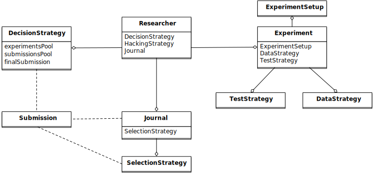

<i>Design</i>
 

In the previous section, while reviewing the underling process of conducting a scientific research, I listed some of the main components and entities involving in different stages of a research, e.g., *Experiment Setup, Experiment, Researcher, Submission*, and *Journal*. In the abstraction, each component  can be seen as a loosely independent entity while the whole system, i.e., *scientific research*, can be described by a set of behaviors, tasks and interactions.

One of our main design goals with SAM was to achieve a level of flexibility where we could modify different aspects of the research process relatively easily. In order to achieve this, we have tried to decouple the system to smaller but conceptually meaningful scientific routines and objects. Figure 1. shows all the components of SAM and their dependencies alongside their interactions with each other. 

This section will clarify the design principles behind each component, how they work and interact with each other in order to simulate the entire process.

## SAM’s Main Components

SAM consists of 3 main components, *Experiment, Researcher* and *Journal*. Each component tries to summarize one of the mentioned subprocesses or entities of a scientific research as described in the [Introduction](Introduction.md). The list below briefly introduces each component and its task and role.

- The [**Experiment**](#experiment) consists of several subroutines and objects dealing with different aspect of a research, e.g., setup, data, test. 
	- [*ExperimentSetup*](#experiment-setup) holds the necessary information and parameters of how the experiment should be defined. Parameters of the ExperimentSetup cannot be modified during the simulation and only can be set at the start of the experiment. In fact, it resembles the *pre-registration*.
	- [*Data Strategy*](#data-strategy) is a routine used to generate the necessary data based on the parameters specified in *ExperimentSetup*.
	- [*Test Strategy*](#test-strategy) is a statistical method of choice in the Experiment Setup for testing the result of the experiment.
- The **[Researcher](#researcher)** object imitates the behaviors of a researcher including his possible questionable research practices. The researcher will define the *ExperimentSetup*, generate/collect the data, run the statistical test, decides whether to preform any QRPs, prepare the *Submission* record, and finally submit it to his *Journal* of choice.
    - [*Decision Strategy*](#decision-strategy) is the underling logic that the researcher uses for selecting an outcome variable for submission.
    - [*Hacking Strategies*](#hacking-strategy) is a list of questionable research practices in researcher's hand in case he decides to hack his way through finding significant results. 
- The [**Journal**](#journal) is a container of *Submission*s, i.e., published studies. The Journal keeps track of its publications and can utilize different metrics to adapts its selection strategy. ***Note**: Unlike an actual scientific journal that covers wide range of research tracks, SAM’s Journal in its current implementation assumes that all submitted publications are from one research track. In other words, SAM’s Journal mainly acts as a pool for meta-analysis.*
    - [*Selection Strategy*](#selection-strategy) is an internal algorithm/criteria of a journal to decided whether a submission is going to be accepted or not. 

After this brief introduction to each component, I will dive deeper in each of them to describe their subprocesses, properties and relations.

SAM utilizes several object-oriented principles and design patterns to achieve the level of flexibility that is offering. Since all comments of SAM are technically  C++ `class`es, from now on, I’ll refer to them as objects, e.g., Experiment object. Moreover, I’ll use monospace font to refer to them as this helps distinguishing them from the rest of the story. 

### Experiment

As mentioned, `Experiment` object acts as an umbrella object for everything related to the an actual experiment. This includes meta data, raw data, method/model for generating the data, e.g., linear model, and method of testing the hypothesis. The `Researcher` object has complete control to every aspects of an `Experiment` with one exception, it can only read but not modify the `ExperimentSetup` object. This is an important factor when we are going to implement the concept of pre-registration.

A short list of variables and methods of `Experiment` is provided below:

- *Data Objects*
	- `measurements`, a dataset of all data points for each group
	- `nobs`, number of observations in each group
	- `means`, mean of each group
	- `vars`, variance of each group
	- `ses`, standard error of each group
	- `statistics`, test statistic of each group, e.g. student-t
	- `pvalue`, p-value of the corresponding test
	- `effects`, effect size of each group
	- `sign`, indicator of significance for each group
- **[`dataStrategy`](#data-strategy)**, a pointer to the selected `DataStrategy`
- **[`testStrategy`](#test-strategy)**, a pointer to the selected `TestStrategy`
- [more ...](doxymark/class_experiment.md)

`Experiment` and `ExperimentSetup` parameters’ can be set via [`Experiment Parameters`](#ConfigurationFileSpecfications.md#experiment-parameters) section of the configuration file.

#### Experiment Setup

SAM treats the `ExperimentSetup` object as readonly object after the initialization phase. During the initialization phase, SAM initialize and randomize the `ExperimentSetup` based on the listed parameters in the configuration file (link to the section). After the initialization phase, `ExperimentSetup` will persist intact in the code and will be used as a reference point in different stages. For instance, if the `Journal` object is designed such that it requires a research to be pre-registrated, `Journal` can access the `ExperimentSetup` and make its decision accordingly. 

A short list of variables and methods of `ExperimentSetup` is provided below:

- `experimentType`, underlying model for generating data.
- `nc`, number of conditions
- `nd`, number of dependent variables
- `ni`, number of items, if necessary
- `true_nobs`, number of observation per group
- `true_means`, mean of each group
- `true_vars`, variance of each group
- `true_sigma`, covariance matrix, if indicated
- [more ...](doxymark/class_experiment_setup.md)

#### Data Strategy

`DataStrategy` acts as the data source. This could be a simple link to certain distribution as specified in `ExperimentSetup` or it could an interface to an input file, e.g. CSV, containing measurements for each group. In general, `DataStrategy` operates by initializing certain variables of `Experiment`. In most cases, an instance of `DataStrategy` object uses a statistical distribution to sample number of data points and initialize the `measurements` variable, but this can change based on the selected model. 

In the case of certain p-hacking methods, e.g., [optional stopping](HackingStrategies.md#optional-stopping), data strategy should also provide a routine for providing extra data points as requested by the optional stopping. 

Available data strategies are discussed in more detail in [Data Strategies](#DataStrategies.md) section.

#### Test Strategy

`TestStrategy` provides the routine for testing the hypothesis. TestStrategy cas access the entire `Experiment` object but often is restricted to modify only relevant variables, e.g., `pvalue, statistics, sig`. 

While the type and parameters of a pre-registered test strategy is preserved in `ExperimentSetup`, the `Researcher` has complete access to the `TestStrategy` and can decide to alternate its parameters or replace it entirely. This can be the case in an specific p-hacking method.

Currently t-test is the only TestStrategy provided by SAM but we plan to add more methods to the pool. T-test needs to know the *side* of the test, whether variances assumed equal and the value of $\alpha$ to derive the significance. These parameters can be set using the [`--test-strategy`](ConfigurationFileSpecifications.md#--test-strategy) section of configuration file.

### Journal

In SAM, the `Journal` object is often a container for accepted publications. `Journal` is designed to mimic the reviewing process. Therefore, it can utilize any arbitrary algorithm for deciding whether a *Submission* is going to be accepted or not. 

A short list of variables and parameters `Journal` is listed below:

- `_max_pubs`, maximum number of publications before stop accepting new publications
- `_pub_bias`, publication bias rate
- `_alpha`, significance $\alpha$. This can be different from `TestStrategy`’s $\alpha$.
- **[`selectionStrategy`](#selection-strategy)**, journal’s selection strategy.
- `isStillAccepting()`, a function returning the state of the journal.
- `review()`, `accept()`, `reject()`, 
- `submissionList`, list of accepted submissions.
- [more ...](doxymark/class_journal.md)

`Journal`’s parameters can be set though [`Journal Parameters`](ConfigurationFileSpecifications.md#journal-parameters) section of the configuration file.

#### Selection Strategy

`SelectionStrategy` implements the logic behind accepting or rejecting a submission. Simplest algorithms are mainly working with *p*-values and based their decision on that. However, more elaborate selection strategies can incorporate different metrics or criteria, e.g., pre-registration, sample sizes, or meta-analysis, into their final decision. For instance, if appropriate, a journal can have an updated estimation of the effect size from its current publications pool and incorporate that to accept or reject widely different submissions.

#### Submission

A `Submission` is a small container, created by the `Researcher` and provided to the `Journal`. It provides a simple interface between `Journal, Experiment` and `Researcher` objects. 

After performing the test and deciding the outcome variable, the `Researcher` put together a report containing necessary information for the `Journal` to be able to make a decision whether to accept or reject the `Experiment`. In other words, a `Submission` resembles a `paper` when it’s at the hand of the researcher and it will resemble a `publication` after being accepted by the journal. 

`Submission`’s variables are:

- `nobs`, number of observations
- `yi`, mean of the selected outcome
- `vi`, variance of the selected outcome
- `estimator`, effect size estimator of choice 
- `ei`, effect size of the select outcome
- `statistics`, the test statistics value
- `pvalue`, *p*-value of the test
- `sig`, a Boolean value indicating the significance of the test
- `side`, the side of the effect, positive or negative
- [more ...](doxymark/class_submission.md)

***Note:** `Submission` is an abstract representation of the paper and publication and it doesn’t try to closely resembles a full publication although it is possible to expand the list of parameters.* 

### Researcher

`Researcher` object is the main player of the simulation. With the exception of `ExperimentSetup` and `Journal`, it can access and modify all other objects if necessary. 

After the initialization of the `ExperimentSetup`, `Researcher` will prepare the `Experiment` object by setting the test strategy, setting the data strategy and finally generating the dataset. Then, it will run the statistical test, and if necessary applies different p-hacking methods on the dataset. Finally, it will prepare a `Submission` record and send it to the `Journal` for review.

`Researcher`’s main methods and variables can be listed as follow:

- **`experiment`**, an instance of [Experiment](#experiment)
- **`journal`**, and instance of [Journal](#journal)
- **[`decisionStrategy`](#decision-strategy)**, researcher’s decision strategy
- *isHacker*, a flag indicating whether the researcher will perform any p-hacking methods on the data
- **[`hackingStrategies`](#hacking-strategy)**, a list of hacking strategies
- `prepareResearch()`, a method to initialize the experiment, i.e., initializing the [`ExperimentSetup`](#experiment-setup) and generating the dataset
- `performResearch()`, a method to calculate the necessary statistics, running the tests, and applying p-hacking methods (if applicable).
- `publishResearch()`, a method to prepare the final [`Submission`](#submission) and submit it to the [`Journal`](#journal) for review.
- [more ...](doxymark/class_researcher.md)

> **NOTE:**\ 
> `Researcher` object is the more complex objects in SAM, especially when complicated decision making and hacking strategies is involved. The rest of this section explains the interaction in detail; however, if you have difficulty understanding the flow, continue reading and everything will be clarified in the next section, when I’ll explain the [Execution Flow](ExecutionFlow.md) of SAM.

#### Decision Strategy

As the name suggests, `DecisionStrategy` is the implementation of how the `Researcher` chooses between different outcome variables during the research. The list below shows a few possible options, started items are not implemented yet. The default is always `PreRegisteredOutcome` which means the `Researcher` always select the pre-registered outcome regardless of its significance. Any other option will set `isHacker` flag to `true`.  

- `PreRegisteredOutcome`
- `MinPvalue`
- `MinSigPvalue`*
- `MaxEffect`
- `MaxSigPvalue`*
- `MaxEffectMinPvalue`*

`Researcher` can consult his decision strategy in different stages of a research. Just before applying any hacking strategies, researcher can check if the pre-registered outcome is significant or not, *initial verdict*. If it not, during the execution of a hacking strategy, researcher can ask his decision strategy whether to interrupt the hacking process or not, *intermediate verdict*. After the completion of a hacking routine, decision strategy can evaluate the outcome, *hacking verdict*. Finally, in his *final verdict*, researcher can look back at history of his `Experiment` and pick the final result to be submitted in the form of `Submission`. *Note: This process will clarify in [Execution Flow](ExecutionFlow.md) section*

Main variables and methods of `DecisionStrategy` are:

- *isStillHacking*, a flag indicating whether the `Researcher` should continue with the hacking procedure, or the result is already satisfactory
- `isPublishable()`, a method indicating if the selected outcome is significant or not
- `submissionsPool`, a history of all `Submission` records during the research
- `experimentsPool`, a history of all modified versions of `Experiment` during the research.
- **`verdict(Experiment, DecisionStage)`**
- `finalSubmission`, 
- [more ...](doxymark/class_decision_strategy.md)

***NOTE:** Decision Strategy is a helper class to implement the decision process more effectively and flexibly throughout the code.*

#### Hacking Strategy

`HackingStrategy` is an *abstract object* representing the main body of different p-hacking or QRP methods. In itself, a `HackingStrategy` object is a simple object with one function `perform`(). The `Researcher` *performs* a hacking strategy by sending a copy of its `Experiment` to the `perform` function. The `HackingStrategy` takes control of the experiment, modifies it, (e.g., adding new values, removing values), recomputes the statistic, rerun the test, and finally returns the modified `Experiment`. At this point, `Researcher` consult his decision strategy, *hacking verdict* to prepare a new `Submission`. 

As mentioned in [Researcher](#researcher), a `Researcher` instance can have a list of **hackingStrategies** in his hand. If there is more than on hacking strategies are registered, `Researcher` performs all hacking methods on different copies of the original Experiment and stores the result in `submissionsPool` and `experimentsPool`. After applying all the method, `Researcher` will ask the `DecisionStrategy` for *final verdict*, and choose among all results as its preparing the `finalSubmission`. 

The [Hacking Strategies](HackingStrategies.md) section will get into more details on each hacking methods.

- - - 
Next: [Execution Flow](ExecutionFlow.md)