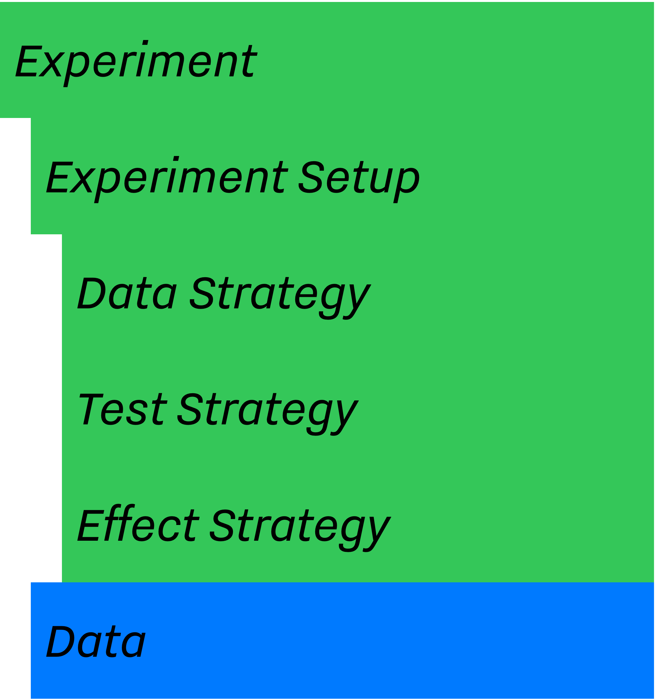
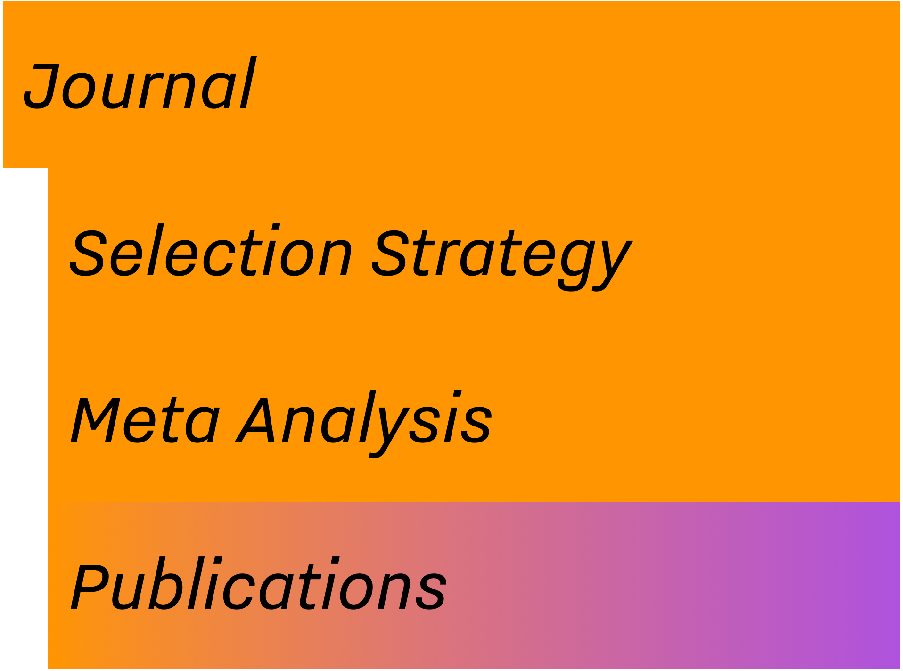
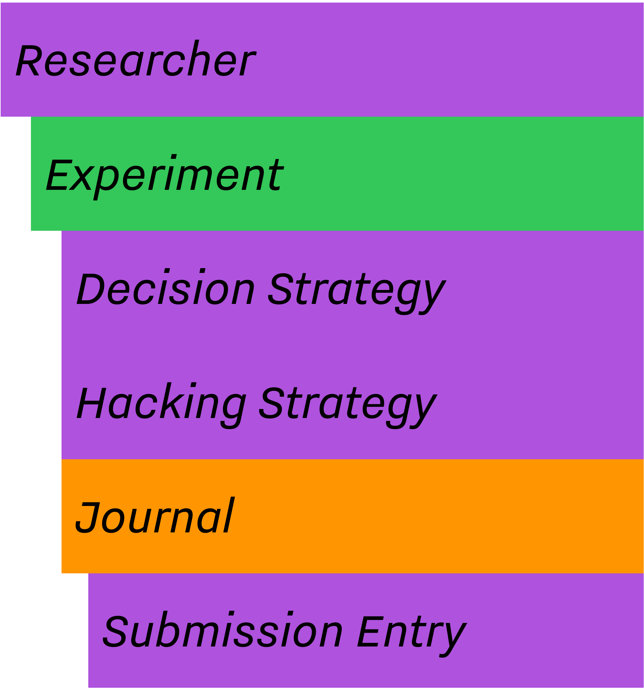

Design
======

In the [previous section](introduction.html#intro-research-process), I
listed some of the main components and entities involving in different
stages of a research, e.g., Experiment Setup, Experiment, Researcher,
Submission, and Journal. *In the abstraction*, each component is a
semi-independent entity while the whole system and process, i.e.,
scientific research, is defined through their interactions.

One of our main design goals with SAM was to achieve a level of
flexibility where we could relatively easily change different aspects of
this process. To achieve this, we decoupled the system to smaller ---
but conceptually meaningful --- routines and entities. Figure 1. shows
SAM\'s components, and their dependencies and interactions with each
other.

This section will clarify the design principles behind each component,
what they try to resemble in the real world and how they work and
interact with each other in order to simulate as much as the scientific
process, as possible.

{.align-center}

SAM's Main Components
---------------------

SAM consists of 3 main components, *Experiment, Researcher* and
*Journal*. Each component mimics one of the subprocesses or entities
that are discussed in the `introduction`{.interpreted-text role="doc"}.
The list below briefly introduces each component and its role.

-   The `design-experiment`{.interpreted-text role="ref"} comprises of
    several parts, each dealing with different aspects of a research,
    e.g., setup, data, test, effect.
    -   `design-experiment-setup`{.interpreted-text role="ref"} holds
        the specification of the design. Researcher can only set these
        parameters once, at the start of an experiment. In fact, the
        *ExperimentSetup* implementation tries to mimic the concept of
        *pre-registration* as closed as possible.
        -   `design-data-strategy`{.interpreted-text role="ref"} is a
            routine used to generate the data based on the specified
            parameters in the *ExperimentSetup*.
        -   `design-test-strategy`{.interpreted-text role="ref"} is the
            statistical method of choice in the *ExperimentSetup* for
            testing the result of an *Experiment*.
        -   `design-effect-strategy`{.interpreted-text role="ref"} is
            the forumla for calculating effect sizes in an experiment.
-   The `design-researcher`{.interpreted-text role="ref"} object
    imitates the behaviors of a researcher, including possible
    questionable research practices conducted by him/her. The researcher
    will define the *ExperimentSetup*, generate and collect the data,
    run the statistical test, decides whether to preform any QRPs,
    prepare the *Submission* record, and finally submit its finding(s)
    to the *Journal* of her/his choice.
    -   `decision-strategies`{.interpreted-text role="ref"} is the
        underling logic of selecting outcome variables between all
        available variables in an experiment.
    -   `hacking-strategies`{.interpreted-text role="ref"} is a list of
        questionable research practices in researcher's arsenal. In the
        case where the researcher decides to hack his/her way through
        finding significant results, he/she can use these methods.
-   The `design-journal`{.interpreted-text role="ref"} is a container
    for `design-submission`{.interpreted-text role="ref"}(s), i.e.,
    published results. The Journal keeps track of its publications and
    can utilize different metrics to adapts its selection strategy.
    -   `selection-strategy`{.interpreted-text role="ref"} is the
        internal algorithm by which the journal decides whether a
        submission will be accepted, or not.
    -   `submission`{.interpreted-text role="ref"} is a short report,
        acting as a *scientific paper*, *a manuscript*. When it gets
        accepted by the *Journal*, it will be a publication.

::: {.note}
::: {.title}
Note
:::

Unlike a real scientific journal that covers a wide range of research
tracks, SAM's Journal in its current implementation assumes that all
submitted publications are from one research track. In other words,
SAM's journals are mainly acting as a pool for related studies.
:::

::: {.note}
::: {.title}
Note
:::

SAM uses several object-oriented principles and design patterns to
achieve the level of flexibility that is offering. Since all components
of SAM are technically C++ classes, from now on, I may refer to them as
objects, e.g., Experiment object, and they will appear in monospace
font.
:::

### Experiment

{.align-right width="50.0%"}

As mentioned, `Experiment` object acts as an umbrella for everything
related to an actual experiment. This includes metadata (a.k.a
`ExperimentSetup`), raw data, method/model for generating the data,
e.g., [Linear Model](data-strategies.rst#data-strategies-linear-model),
and methods of testing the hypothesis, and calculating the effect. The
`Researcher` object has the complete control over every aspects of an
`Experiment` **with one exception**: it can only read and not change the
`ExperimentSetup` object. This is an important factor when later on we
implement the concept of pre-registration.

Below is a short list of variables and methods of `Experiment`.

-   `Data` object
    -   `measurements`, a dataset of all data points for each group
    -   `nobs`, the number of observations in each group
    -   `means`, the mean of each group
    -   `vars`, the variance of each group
    -   `ses`, the standard error of each group
    -   `statistics`, test statistic of each group, e.g. student-t
    -   `pvalue`, p-value of the corresponding test
    -   `effects`, the effect size of each group
    -   `sign`, an indicator of significance for each group
-   `setup`, a reference to the
    `design-experiment-setup`{.interpreted-text role="ref"}.

A full list of available parameters are listed in the
`config-file-experiment-parameters`{.interpreted-text role="ref"}
section of the configuration file.

#### Experiment Setup

SAM treats the `ExperimentSetup` object as a read-only object after the
initialization phase. During the initialization phase, SAM initializes
and randomizes the `ExperimentSetup` based on given criteria. After the
initialization phase, `ExperimentSetup` will stay intact in the code and
will be used as a reference point in different stages.

Below is a list of variables and methods of `ExperimentSetup`, read more
[here](configuration-file.html#config-file-experiment-parameters) and
`data-strategies`{.interpreted-text role="doc"}:

-   `nc`, the number of conditions
-   `nd`, the number of dependent variables
-   `dataStrategy`, a pointer to the selected
    `data-strategies`{.interpreted-text role="doc"}.
-   `testStrategy`, a pointer to the selected
    `test-strategies`{.interpreted-text role="doc"}.
-   `effectStrategy`, a pointer to the selected
    `effect-strategies`{.interpreted-text role="doc"}.

#### Data Strategy

`DataStrategy` acts as the population for the study, i.e., *data
source*. This could be a simple link to a certain distribution \[or it
could be an interface to an input file, e.g., a CSV file containing
measurements for each group\]. In general, `DataStrategy` is responsible
for initializing certain variables of the `Experiment`.

In most cases, an instance of `DataStrategy` object uses a statistical
distribution to sample number of data points and populates the
`measurements` variable, but this differs for different model. With
certain *p*-hacking methods, e.g., [optional
stopping](hacking-strategies.rst#optional-stopping), the data strategy
should be able to provide a routine for generating *extra* data points
as requested by the optional stopping.

Data strategies will be discussed in more details in
`design-strategies`{.interpreted-text role="doc"} chapter.

#### Test Strategy

`TestStrategy` provides a routine for testing the hypothesis.
TestStrategy can access the entire `Experiment` object but often it is
restricted to only modifying relevant variables, e.g.,
`pvalue, statistics, sig`.

There are several test strategies already implemented:

-   T-Test
-   F-Test
-   Yuen T-Test
-   Wilcoxn Test

More details about will be discussed in
`test-strategies`{.interpreted-text role="doc"} chapter.

#### Effect Strategy

`EffectStrategy` defines a method of calculating the magnitude of effect
between two experimental group. Like most other strategies, users are
able to define their own effect strategy. This will be discussed in
`extending-sam`{.interpreted-text role="doc"}.

List of available effect strategies:

> -   Cohen\'s D
> -   Hedge\'s G
> -   Odd Ratio
> -   Mean Difference

### Journal

{.align-right width="50.0%"}

In SAM, a `Journal` is often a container for *accepted* publications.
`Journal` is designed to mimic the reviewing process. Therefore, it can
use any arbitrary algorithms for deciding whether a submission will be
accepted or not.

Below is the list of some of the variables and methods of `Journal`.

-   `max_pubs`, maximum number of publications before journal stops
    accepting new publications
-   `pub_bias`, the publication bias rate
-   `alpha`, the significance $\alpha$. **Note:** This can differ from
    `TestStrategy`'s $\alpha$.
-   `selectionStrategy`, journal's
    `design-selection-strategy`{.interpreted-text role="ref"}.
-   `isStillAccepting()`, a function returning the state of the journal.
-   `review()`, `accept()`, `reject()`,

\- `submissionList`, a list of accepted submissions, i.e.,

:   publications.

You can set these parameters using
[journal_parameters](configuration-file.rst#config-file-journal-parameters)
section of the configuration file.

#### Selection Strategy

`SelectionStrategy` implements the logic behind accepting or rejecting a
submission. The simplest algorithms are mainly working with *p*-values
and based their decision on a simple threshold check. However, more
elaborate selection strategies can incorporate different metrics or
criteria (e.g., pre-registration, sample sizes, or meta-analysis) into
their final decision. For instance, if appropriate, a journal can have
an updated estimation of the effect size from its current publications
pool and use that information to accept or reject submissions.

#### Submission

A `Submission` is a small container, created by the `Researcher` and
provided to the `Journal`. It provides a simple interface between
`Journal, Experiment` and `Researcher` objects. In fact, a `Submission`
resembles a *manuscript* when it is at the hand of the researcher and a
*publication* after being accepted by the journal.

After performing the test and choosing the outcome variable, the
`Researcher` puts together a report containing necessary information for
the `Journal` to decide whether to accept or reject the submitted
finding(s).

`Submission`'s variables are:

-   `nobs`, the number of observations
-   `yi`, the mean of the selected outcome
-   `vi`, the variance of the selected outcome
-   `estimator`, effect size estimator of choice
-   `ei`, the effect size of the select outcome
-   `statistics`, the test statistics value
-   `pvalue`, the *p*-value of the test
-   `sig`, a boolean value indicating the significance of the test

\- `side`, the side of the effect, positive or negative .. -
`more … exhale_class_class_submission`{.interpreted-text role="ref"}

::: {.note}
::: {.title}
Note
:::

`Submission` is an abstract representation of the manuscript and it does
not try to closely resembles a full publication.
:::

### Researcher

{.align-right width="50.0%"}

`Researcher` object is the main player in the simulation. It\'s a
central piece of the research, it uses the `ExperimentSetup` to prepare
the `Experiment` and send the final outcome to the `Journal` for
reviewing process.

After the initialization of the `ExperimentSetup`, `Researcher` will
prepare the `Experiment` object by collecting data through the data
strategy, testing the hypothesis via the test strategy, and calculating
the effect sizes using the effect strategy. Then, if programmed to, it
applies different *p*-hacking methods on the dataset and hacks its way
through a significant result. In the end, the researcher prepares a
`Submission` record and send it to the `Journal` for review. This
process is discussed in more detailed in `flow`{.interpreted-text
role="doc"} chapter.

Below is a list of main methods and variables of `Researcher`.

-   `experiment`, an instance of `design-experiment`{.interpreted-text
    role="ref"}
-   `journal`, an instance of `design-journal`{.interpreted-text
    role="ref"}
-   `decisionStrategy`, an instance of
    `design-decision-strategy`{.interpreted-text role="ref"}.
-   *isHacker*, a flag indicating whether the researcher will perform
    any p-hacking methods on the data
-   `hackingStrategies`, a list of
    `hacking-strategies`{.interpreted-text role="doc"}.
-   `prepareResearch()`, a method to initialize the experiment
-   `performResearch()`, a method to calculate the necessary statistics,
    running the tests, and applying p-hacking methods (if applicable).

\- `publishResearch()`, a method to prepare the final

:   `submission`{.interpreted-text role="ref"} and submit it to the
    `journal`{.interpreted-text role="ref"} for review.

#### Decision Strategy

As the name suggests, `DecisionStrategy` describes how the `Researcher`
chooses between different outcome variables during the research. The
list below shows a few available options. The default is always
`PreRegisteredOutcome` which means the `Researcher` always selects the
pre-registered outcome regardless of its significance.

-   `PreRegisteredOutcome`
-   `MinPvalue`
-   `MaxEffect`
-   `MaxEffectMinPvalue`

`Researcher` can consult his *Decision Strategy* in different stages of
the research. **1)** Just before applying any hacking strategies, a
researcher can check if the pre-registered outcome is significant or
not, *initial verdict*. **2)** If it is not, during the execution of a
hacking strategy, it can ask the decision strategy whether to interrupt
the hacking process, *intermediate verdict*. **3)** After the completion
of a hacking routine, the decision strategy evaluates the outcome,
*hacking verdict*. **4)** Finally, in his *final verdict*, a researcher
can look back at the history of his `Experiment` and pick the final
result that is going to be submitted in the form of `Submission`.

Main variables and methods of `DecisionStrategy` are:

-   *isStillHacking*, a flag indicating whether the `Researcher` should
    continue with the hacking procedure, or the result is already
    satisfactory
-   `isPublishable()`, a method indicating if the selected outcome is
    significant or not
-   `submissionsPool`, a history of all `Submission` records during the
    research
-   `experimentsPool`, a history of all modified versions of
    `Experiment` during the research.

\- `verdict(Experiment, DecisionStage)` .. - `finalSubmission`, .. -
`more … <exhale_class_class_experiment_setup>`{.interpreted-text
role="ref"}

::: {.note}
::: {.title}
Note
:::

The decision strategy is one of the more complicated pieces of SAM. It
engages in different stages of conducting the research by researcher and
different hacking strategies. This process will be clarified in
`flow`{.interpreted-text role="doc"} and
`decision-strategies`{.interpreted-text role="doc"} chapters.
:::

#### Hacking Strategy-(ies)

`HackingStrategy` is an abstract representation of different *p*-hacking
and QRP methods. A `HackingStrategy` object is a simple object with one
function `perform()`. The `Researcher` *performs* a hacking strategy by
sending a copy of its `Experiment` to the `perform` function. The
`HackingStrategy` takes control of the experiment, modifies it, (e.g.,
adding new values, removing values), recomputes the statistic, reruns
the test, and finally returns the modified `Experiment`.

As mentioned in `design-researcher`{.interpreted-text role="ref"}
section, a `Researcher` instance can be equipped with a list
**hackingStrategies**. If more than one hacking strategy is registered,
`Researcher` performs all hacking methods on different copies of the
original experiment and stores the result in `submissionsPool` and
`experimentsPool`. After applying all methods, `Researcher` will ask the
`DecisionStrategy` for its *final verdict*, and choose among all results
before preparing the *final submission*.

The `hacking-strategies`{.interpreted-text role="doc"} chapter will
shine more light on details of each hacking strategy.
