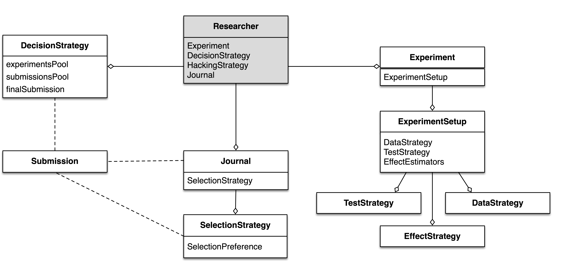

.. _chap-design:

Design
======

In the `previous section <introduction.html#intro-research-process>`__, I listed some of the main components
and entities involving in different stages of a research, e.g.,
Experiment Setup, Experiment, Researcher, Submission, and Journal.
*In the abstraction*, each component is a semi-independent entity while
the whole system and process, i.e., scientific research process, is defined
through a set of interactions between them.

One of our main design goals with SAM was to achieve a level of
flexibility where we could relatively easily change different aspects of
the research process. To achieve this, we decoupled the
system to smaller — but conceptually meaningful — routines and
entities. Figure 1. shows all the components of SAM and their
dependencies and their interactions with each other.

This section will clarify the design principles behind each component,
what they try to resemble in the real world and how they work and
interact with each other in order to simulate as much as possible of the scientific process.



   SAM’s components and their interactions


.. _design-components:

SAM’s Main Components
---------------------

SAM consists of 3 main components, *Experiment, Researcher* and
*Journal*. Each component mimics 
one of the subprocesses or entities that are discussed in the 
:doc:`introduction`. The list below briefly introduces
each component and its role.

-  The :ref:`design-experiment` comprises of several subroutines and
   objects dealing with different aspects of a research, e.g., setup,
   data, test, effect.

   -  :ref:`design-experiment-setup` holds the parameters of an
      experiment design. Researcher can only set these parameters once, at the start
      of the experiment. In fact, the *ExperimentSetup* implementation tries to resemble the concept of *pre-registration* as close as possible.
      -  :ref:`design-data-strategy` is a routine used to generate
         the data based on the specified parameters in the
         *ExperimentSetup*.
      -  :ref:`design-test-strategy` is a statistical method of
         choice in the *ExperimentSetup* for testing the result of the
         *Experiment*.
      -  :ref:`design-effect-strategy` is the forumla for calculating effect sizes in an experiment.

-  The :ref:`design-researcher` object imitates the behaviors of a
   researcher, including possible questionable research practices conducted by him/her. The researcher will define the *ExperimentSetup*, generate and collect the data, run the statistical test, decides whether to preform any
   QRPs, prepare the *Submission* record, and finally submit the outcome to his
   *Journal* of choice.

   -  :ref:`decision-strategies` is the underling logic
      of selecting outcome variables between all available variables in an experiment.
   -  :ref:`hacking-strategies` is a list of
      questionable research practices in researcher’s arsenal. In the case
      where the researcher decides to hack his/her way through finding significant
      results, he/she uses these methods.

-  The :ref:`design-journal` is a container of :ref:`design-submission`\ (s), i.e.,
   published studies. The Journal keeps track of its publications and
   can utilize different metrics to adapts its selection strategy.

   -  :ref:`selection-strategy` is the internal
      algorithm by which the journal decides whether a submission will
      be accepted.
   -  :ref:`submission` is a short report, acting as a
      *scientific paper*. When it gets accepted by the *Journal*, it
      considered as a publication.

.. note::

   Unlike a real scientific journal that covers a wide
   range of research tracks, SAM’s Journal in its current implementation
   assumes that all submitted publications are from one research track.
   In other words, SAM’s ``Journal`` mainly acts as a pool of related studies.

.. note::

   SAM uses several object-oriented principles and design patterns to
   achieve the level of flexibility that is offering. Since all components
   of SAM are technically C++ classes, from now on, I’ll refer to them as
   objects, e.g., Experiment object.

.. _design-experiment:

Experiment
~~~~~~~~~~

.. figure:: figures/experiment-stack.png
   :align: right
   :width: 50%

As mentioned, ``Experiment`` object acts as an umbrella object for
everything related to an actual experiment. This includes metadata
(a.k.a ``ExperimentSetup``), raw data, method/model for generating the data,
e.g., :ref:`data-strategies-linear-model`, and methods of
testing the hypothesis, and calculating the effect.
The ``Researcher`` object has the complete
control over every aspects of an ``Experiment`` **with one exception**, it
can only read but not change the ``ExperimentSetup`` object. This is an
important factor when later we implement the concept of
pre-registration.

Below is a short list of variables and methods of ``Experiment``.

-  *Data Objects*

   -  ``measurements``, a dataset of all data points for each group
   -  ``nobs``, the number of observations in each group
   -  ``means``, the mean of each group
   -  ``vars``, the variance of each group
   -  ``ses``, the standard error of each group
   -  ``statistics``, test statistic of each group, e.g. student-t
   -  ``pvalue``, p-value of the corresponding test
   -  ``effects``, the effect size of each group
   -  ``sign``, an indicator of significance for each group

-  ``dataStrategy``, a pointer to the selected
   :doc:`data-strategies`.
-  ``testStrategy``, a pointer to the selected
   :doc:`test-strategies`.
-  ``effectStrategy``, a pointer to the selected 
   :doc:`effect-strategies`.
-  :ref:`more … exhale_class_class_experiment`

A full list of available parameters are listed in the
:ref:`config-file-experiment-parameters` section of the configuration file.

.. _design-experiment-setup:

Experiment Setup
^^^^^^^^^^^^^^^^

SAM treats the ``ExperimentSetup`` object as a read-only object after
the initialization phase. During the initialization phase, SAM
initializes and randomizes the ``ExperimentSetup`` based on the listed
parameters in the configuration file (link to the section). After the
initialization phase, ``ExperimentSetup`` will persist intact in the
code and will be used as a reference point in different stages. 

.. For instance, if you define a ``Journal`` in such that it requires the study
.. to be pre-registered, ``Journal`` can then access the
.. ``ExperimentSetup`` and adjust its verdict accordingly.

Below is a list of variables and methods of ``ExperimentSetup``, read
more `here <configuration-file.html#config-file-experiment-parameters>`__
and :doc:`decision-strategies`.

-  ``experimentType``, underlying model for generating data.
-  ``nc``, the number of conditions
-  ``nd``, the number of dependent variables
-  ``ni``, the number of items, if necessary
-  ``true_nobs``, the number of observation per group
-  ``true_means``, the mean of each group
-  ``true_vars``, the variance of each group
-  ``true_sigma``, the covariance matrix, if indicated.
-  :ref:`more … exhale_class_class_experiment_setup`

.. _design-data-strategy:

Data Strategy
^^^^^^^^^^^^^

``DataStrategy`` acts as the study population, i.e., *data source*. This could
be a simple link to a certain distribution as specified in
``ExperimentSetup`` [or it could be an interface to an input file, e.g.,
a CSV file containing measurements for each group]. In general,
``DataStrategy`` is responsible for initializing certain variables of
the ``Experiment``. In most cases, an instance of ``DataStrategy``
object uses a statistical distribution to sample number of data points
and populates the ``measurements`` variable, but this can change based
on the selected model. With certain *p*-hacking methods, e.g., `optional stopping <hacking-strategies.rst#optional-stopping>`__, the data strategy
should also provide a routine for generating extra data points as
requested by the optional stopping.

Data strategies will be discussed in more details in :ref:`decision-strategies` chapter.

.. _design-test-strategy:

Test Strategy
^^^^^^^^^^^^^

``TestStrategy`` provides a routine for testing the hypothesis.
TestStrategy can access the entire ``Experiment`` object but often it is
restricted to only modifying relevant variables, e.g.,
``pvalue, statistics, sig``.

There are several test strategies already implemented:

-  T-Test
-  F-Test
-  Yuen T-Test
-  Wilcoxn Test

.. While the type and parameters of a pre-registered test strategy is
.. preserved in ``ExperimentSetup``, ``Researcher`` has complete access to
.. the ``TestStrategy`` and can decide to alternate its parameters or
.. replace it entirely. This can be the case for a specific *p*-hacking
.. method.

.. Currently, t-test is the only TestStrategy provided by SAM but we plan
.. to add more methods to the pool. T-test needs to know the *side* of the
.. test, whether variances assumed equal and the value of :math:`\alpha` to
.. derive the significance. You can set these parameters using the
.. :ref:```--test-strategy`` config-file-test-strategy`
.. chapter of the configuration file.

More details about will be discussed in :doc:`test-strategies` chapter.

.. _design-journal:

Journal
~~~~~~~

.. figure:: figures/journal-stack.png
   :align: right
   :width: 50%

In SAM, ``Journal`` is often a container for *accepted* publications. ``Journal`` is designed to mimic the reviewing process.
Therefore, it can use any arbitrary algorithm for deciding whether a
submission will be accepted or not.

Below is a list of variables and parameters of ``Journal``.

-  ``max_pubs``, maximum number of publications before journal stops
   accepting new publications
-  ``pub_bias``, the publication bias rate
-  ``alpha``, the significance :math:`\alpha`. **Note:** This can
   differ from ``TestStrategy``\’s :math:`\alpha`.
-  ``selectionStrategy``, journal’s :ref:`design-selection-strategy`.
-  ``isStillAccepting()``, a function returning the state of the
   journal.
-  ``review()``, ``accept()``, ``reject()``,
-  ``submissionList``, a list of accepted submissions, i.e.,
   publications.
-  :ref:`more … exhale_class_class_journal`

You can set these parameters using
:ref:`config-file-journal-parameters` section of the configuration file.

.. _design-selection-strategy:

Selection Strategy
^^^^^^^^^^^^^^^^^^

``SelectionStrategy`` implements the logic behind accepting or rejecting
a submission. The simplest algorithms are mainly working with *p*-values
and based their decision on simple threshold check. However, more elaborate selection
strategies can incorporate different metrics or criteria (e.g.,
pre-registration, sample sizes, or meta-analysis) into their final
decision. For instance, if appropriate, a journal can have an updated
estimation of the effect size from its current publications pool and use
that information to accept or reject submissions.

.. _design-submission:

Submission
^^^^^^^^^^

A ``Submission`` is a small container, created by the ``Researcher`` and
provided to the ``Journal``. It provides a simple interface between
``Journal, Experiment`` and ``Researcher`` objects.

After performing the test and choosing the outcome variable, the
``Researcher`` puts together a report containing necessary information
for the ``Journal`` to decide whether to accept or reject the
``Experiment``. In fact, a ``Submission`` resembles a *manuscript* when it is
at the hand of the researcher and a *publication* after
being accepted by the journal.

``Submission``\’s variables are:

-  ``nobs``, the number of observations
-  ``yi``, the mean of the selected outcome
-  ``vi``, the variance of the selected outcome
-  ``estimator``, effect size estimator of choice
-  ``ei``, the effect size of the select outcome
-  ``statistics``, the test statistics value
-  ``pvalue``, the *p*-value of the test
-  ``sig``, a boolean value indicating the significance of the test
-  ``side``, the side of the effect, positive or negative
-  :ref:`more … exhale_class_class_submission`

.. note::

    ``Submission`` is an abstract representation of the manuscript
    and publication and it does not try to closely resembles a full
    publication although it is possible to expand the list of parameters.

.. _design-researcher:

Researcher
~~~~~~~~~~

.. figure:: figures/researcher-stack.png
   :align: right
   :width: 50%

``Researcher`` object is the main player in the simulation. It's a central piece of the research, it uses the ``ExperimentSetup`` to prepare the ``Experiment`` and send the final outcome to the ``Journal`` for reviewing process.

After the initialization of the ``ExperimentSetup``, ``Researcher`` will
prepare the ``Experiment`` object by collecting data through the data strategy, testing the hypothesis via the test strategy, and calculating the effect sizes using the effect strategy. Then, if programmed to, it applies different *p*-hacking methods on the dataset and hacks its way through a 
significant result. In the end, it prepares a
``Submission`` record and send it to the ``Journal`` for review. This process is discussed in more detailed in :doc:`flow` chapter.

Below is a list of main methods and variables of ``Researcher``.

-  ``experiment``, an instance of :ref:`design-experiment`
-  ``journal``, an instance of :ref:`journal`
-  :ref:```decisionStrategy`` decision-strategy`, researcher’s decision
   strategy
-  *isHacker*, a flag indicating whether the researcher will perform any
   p-hacking methods on the data
-  ``hackingStrategies``, a list of :doc:`hacking-strategies`\ (s).
-  ``prepareResearch()``, a method to initialize the experiment, i.e.,
   initializing the ```ExperimentSetup`` <#experiment-setup` and
   generating the dataset
-  ``performResearch()``, a method to calculate the necessary
   statistics, running the tests, and applying p-hacking methods (if
   applicable).
-  ``publishResearch()``, a method to prepare the final
   :ref:`submission` and submit it to the
   :ref:`journal` for review.
-  :ref:`more … exhale_class_class_researcher`

.. _design-decision-strategy:

Decision Strategy
^^^^^^^^^^^^^^^^^

As the name suggests, ``DecisionStrategy`` describes how the ``Researcher`` chooses between different outcome variables during
the research. The list below shows a few available options. The default is always
``PreRegisteredOutcome`` which means the ``Researcher`` always selects
the pre-registered outcome regardless of its significance. 

-  ``PreRegisteredOutcome``
-  ``MinPvalue``
-  ``MaxEffect``
-  ``MaxEffectMinPvalue``

``Researcher`` can consult his *Decision Strategy* in different stages
of the research. Just before applying any hacking strategies, a
researcher can check if the pre-registered outcome is significant or
not, *initial verdict*. If it is not, during the execution of a hacking
strategy, it can ask the decision strategy whether to interrupt the
hacking process, *intermediate verdict*. After the completion of a
hacking routine, the decision strategy evaluates the outcome, *hacking
verdict*. Finally, in his *final verdict*, a researcher can look back at
the history of his ``Experiment`` and pick the final result that is
going to be submitted in the form of ``Submission``. 

Main variables and methods of ``DecisionStrategy`` are:

-  *isStillHacking*, a flag indicating whether the ``Researcher`` should
   continue with the hacking procedure, or the result is already
   satisfactory
-  ``isPublishable()``, a method indicating if the selected outcome is
   significant or not
-  ``submissionsPool``, a history of all ``Submission`` records during
   the research
-  ``experimentsPool``, a history of all modified versions of
   ``Experiment`` during the research.
-  ``verdict(Experiment, DecisionStage)``
-  ``finalSubmission``,
-  :ref:`more … <exhale_class_class_experiment_setup>`

.. note::
 
   The decision strategy is one of the more complicated pieces of SAM. It engages in different stages of conducting the research by researcher and different hacking strategies. This process will be clarified in :doc:`flow` and :doc:`decision-strategies` chapters.

.. .. note::

..    Decision Strategy is a helper class to implement the
..    decision process more effectively and flexibly throughout the code.

.. _design-hacking-strategy:

Hacking Strategy-(ies)
^^^^^^^^^^^^^^^^^^^^^^

``HackingStrategy`` is an abstract representation of
different *p*-hacking and QRP methods. A ``HackingStrategy`` object is a
simple object with one function ``perform()``. The ``Researcher``
*performs* a hacking strategy by sending a copy of its ``Experiment`` to
the ``perform`` function. The ``HackingStrategy`` takes control of the
experiment, modifies it, (e.g., adding new values, removing values),
recomputes the statistic, reruns the test, and finally returns the
modified ``Experiment``.

.. At this point, ``Researcher`` consults the
.. decision strategy, *hacking verdict*, to prepare a new ``Submission``.

As mentioned in :ref:`design-researcher` section, a ``Researcher``
instance can be equipped with a list **hackingStrategies**. If there is
more than one hacking strategy is registered, ``Researcher`` performs
all hacking methods on different copies of the original experiment and
stores the result in ``submissionsPool`` and ``experimentsPool``. After
applying all methods, ``Researcher`` will ask the ``DecisionStrategy``
for its *final verdict*, and choose among all results to come up with
its *final submission*.

The :doc:`hacking-strategies` chapter will shine more light on details of each hacking strategy.
