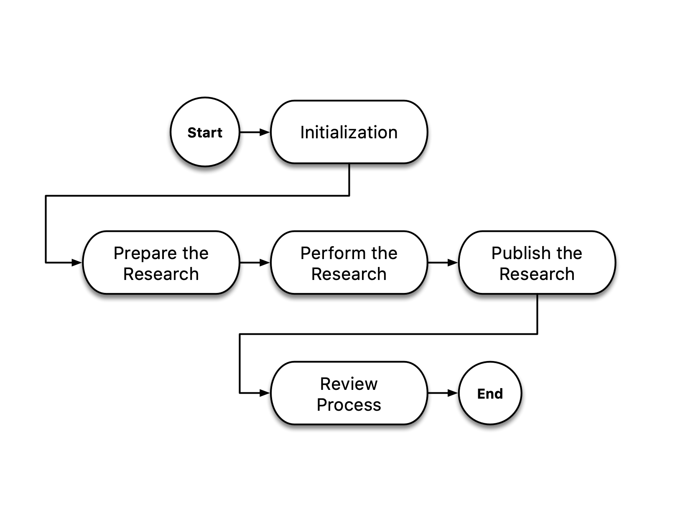
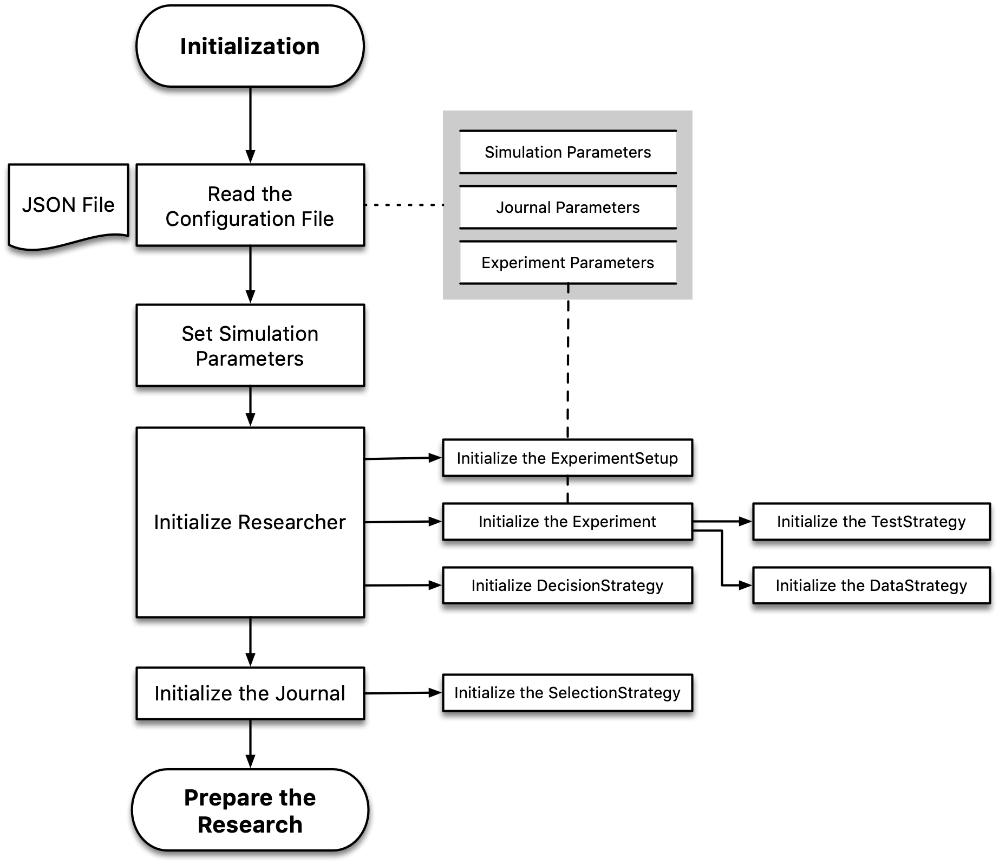
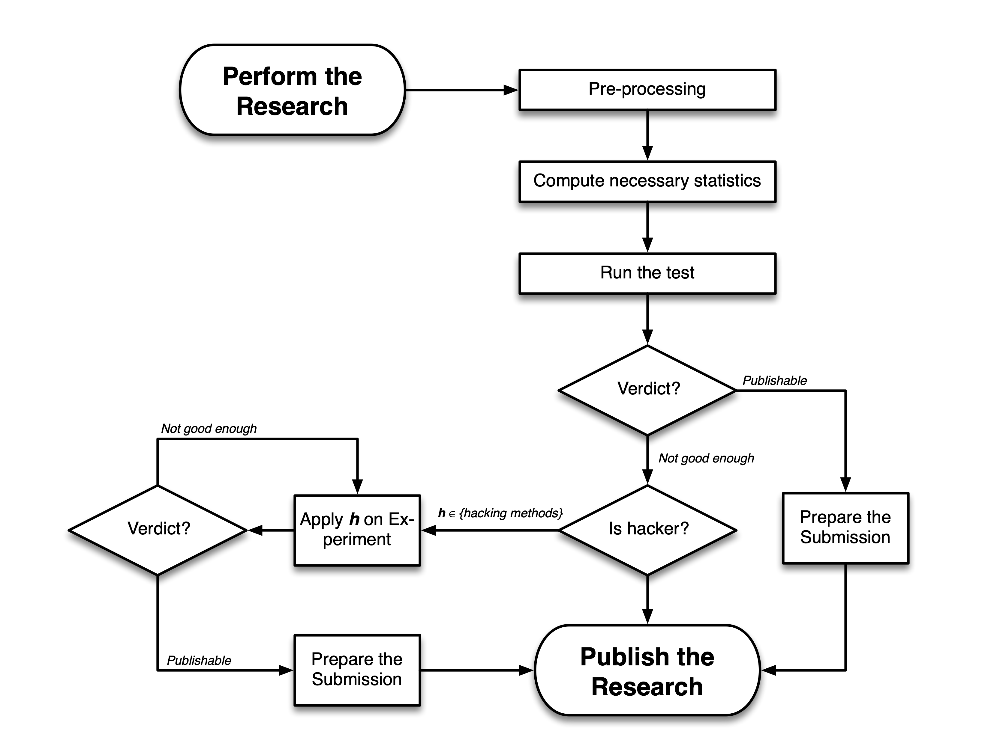

.. _chap-flow:

Flow
====

SAM simulates the scientific process through several subprocesses as
depicted in the following flowchart. Each rounded rectangle describes a
process, often performs by one of the components or through
collaboration between different components. This section describes each
subprocess in more details.

   
   Overall execution flowchart of SAM

.. _flow-initialization:

Initialization
--------------

During the initialization phase, SAMs loads a configuration file and
initializes different compartments based on the parameters. You can read
more about the parameters :ref:`here config-file`.
After reading user’s parameters, SAM proceeds with initializing each of
its components.

.. _flow-prepare-research:

Prepare Research
----------------

The preparation of the research is the first step in the simulation.
This step resembles the process of defining a study and finally
collecting the data for the study. As we discussed in the
:ref:`design` section, ``ExperimentSetup`` is a
read-only object except the case that a user prefers to randomize one of
its parameters in each different runs of SAM, for instance, randomizing
the number of observations to study its effect on a particular metric.
This can be done by setting ``nobs`` parameters to “random”. Here, SAM
first randomizes the ``ExperimentSetup`` before making it a read-only
object.

The next step is allocating memory for the data, and analysis through
the simulation. And finally, Experiment uses its already initialized
``DataStrategy`` to draw a sample from the given population or
distribution. This will populate the ``measurements`` variable.

.. figure:: figures/prepare-research.png
   :align: center

.. _flow-perform-research:

Perform Research
----------------

Performing the research can be closely tied to the data processing
process. At this stage, ``Researcher`` uses the ``TestStrategy`` of
the ``Experiment`` to run the test and populated parameters like
``statistic, pvalue, sig, side``, etc.

The next step is to check whether or not the Researcher is satisfied
with test results. This is being done by passing the ``Experiment``
to the ``DecisionStrategy``. ``Researcher`` relies on
DecisionStrategy’s verdict to decide whether it proceeds with the
Submission or it continues applying one or more hacking methods on the
experiment before submitting the experiment for the review. As
mentioned, Researcher can have access to a list of hacking methods. For
each hacking method, **h**, in its arsenal, a copy of Experiment is
passed to the hacking method. Based on the hacking method,
``Researcher`` could ask ``DecisionStrategy`` whether it should continue
or stop. For instance, with optional stopping, Researcher can decide
after each addition whether or not its satisfied, *intermediate
verdict.*

.. _flow-publish-research:

Publish Research
----------------

Process of publishing the research resembles the preparation of final
Submission and sending it to the Journal for review.

After applying the last hack, ``Researcher`` will proceed with
preparation of its **final** Submission, by asking ``DecisionStrategy``
for its *final verdict*. This is where ``Researcher`` looks backs at
different versions of ``Experiment`` or ``Submission`` and pick the most
satisfying record.

At this stage, despite finding any significant results, ``Researcher``
**must** prepare a Submission record and submit it to the ``Journal``
for review. Journal will judge the submitted ``Submission``\’s based on
the criteria of the ``SelectionStrategy``. If accepted, ``Journal`` adds
the submission to its publication lists for further analysis or
adjustment of its ``SelectionStrategy``.

.. figure:: figures/publish-research.png
   :align: center

